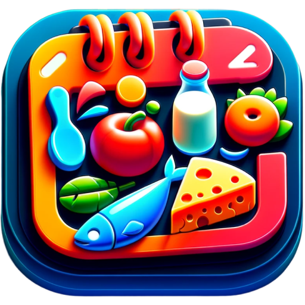
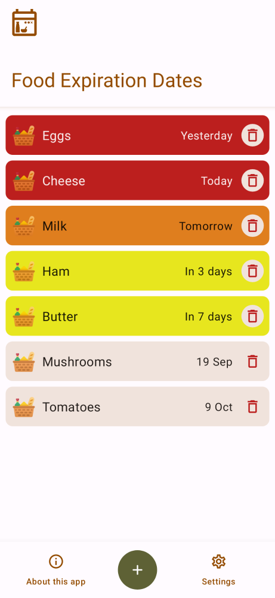
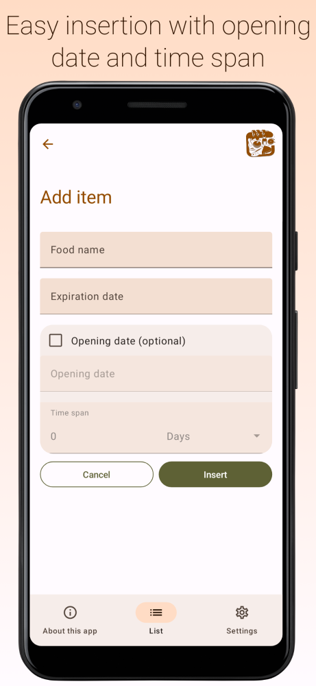
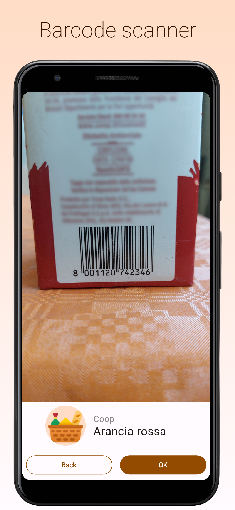
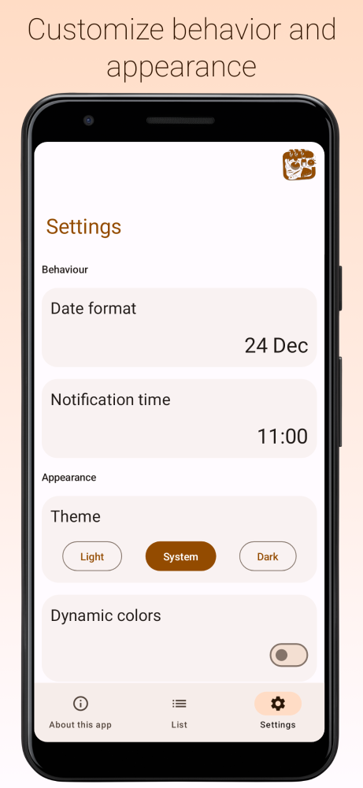
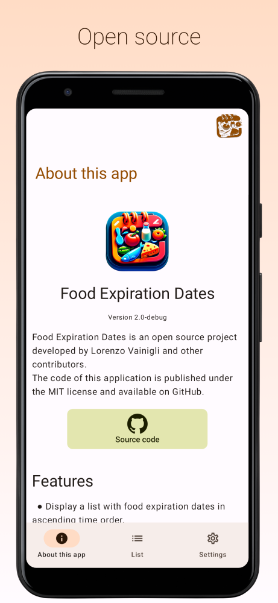
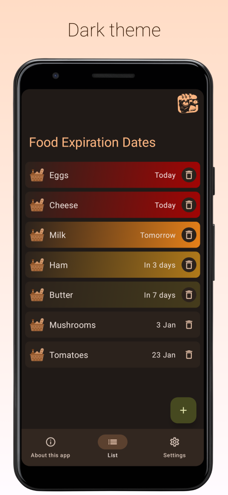
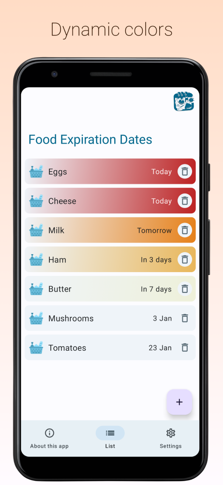
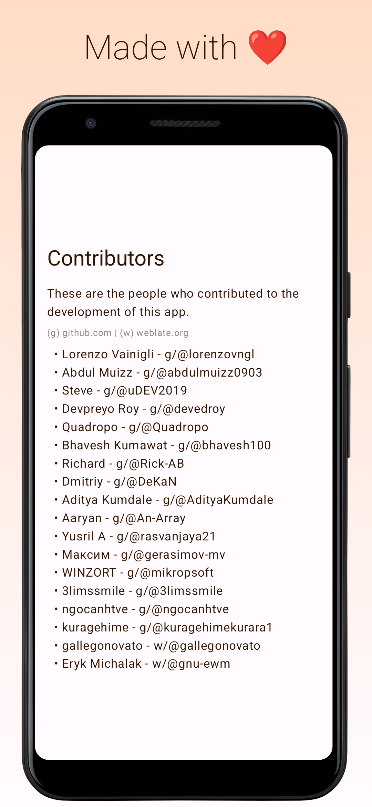

<div align="center">



# Food Expiration Dates

[](https://github.com/lorenzovngl)

[](https://discord.gg/UVpzQqzg5c)

[](https://github.com/protontypes/open-sustainable-technology)


<a href="https://gitmoji.dev">
  
</a>

</div>

Have you ever forgotten to eat a food item before its expiration date? Throwing away food because it has expired is a practice to avoid if you want to reduce food waste.

This simple app helps you avoid forgetting to consume foods that are about to expire. Using it is simple: just record each food item along with its expiration date and you will always have a table reminding you which foods are going to expire!

<div align="center">


[](https://play.google.com/store/apps/details?id=com.lorenzovainigli.foodexpirationdates)
[](https://github.com/lorenzovngl/FoodExpirationDates/releases)
[](https://apt.izzysoft.de/fdroid/index/apk/com.lorenzovainigli.foodexpirationdates.foss/)


</div>

## ✨ Features

- Display a list of food with their expiration dates in ascending order of time
- Add, edit and delete items
- Product retrieval using barcode scanner and [Open Food Facts](https://world.openfoodfacts.org/) API
- Opening date
- Notifications

## 📱 Screenshots

<div align="center">

| | | | |
|-|-|-|-|
|  |  |  |  | 

| | | | |
|-|-|-|-|
|  |  |  |  |

</div>

## 🌐 Languages

<div align="center">

[](https://hosted.weblate.org/engage/food-expiration-dates/)

[](https://hosted.weblate.org/engage/food-expiration-dates/)

</div>

> You can help translating this project on [Hosted Weblate](https://hosted.weblate.org/engage/food-expiration-dates/).

## 🏗️ Installation steps

1. Clone the repository

    ```bash
    git clone https://github.com/lorenzovngl/FoodExpirationDates.git
    ```

2. Setup your Firebase project as described below **or** set `buildFoss = true` in [build.gradle.kts](https://github.com/lorenzovngl/FoodExpirationDates/blob/main/app/build.gradle.kts#L12) and switch to the `foss` build variant to disable the Firebase SDK in the app.

   - Setup your Firebase project:

      1. Create a Firebase project in [Firebase console](https://console.firebase.google.com/);
      2. Get the file `google-services.json` as [explained here](https://support.google.com/firebase/answer/7015592#zippy=%2Cin-this-article:~:text=Get%20config%20file%20for%20your%20Android%20app) and put it in the project root.


3. Run the app!

## 📚 Third Party

- [Material Design Icons](https://pictogrammers.com/library/mdi/)
- [Icons8 Fluency Icons](https://icons8.it/icons/fluency)

## 👥 Contributors

<a href="https://github.com/lorenzovngl"></a>
<a href="https://github.com/abdulmuizz0903"></a>
<a href="https://github.com/uDEV2019"></a>
<a href="https://github.com/devedroy"></a>
<a href="https://github.com/Quadropo"></a>
<a href="https://github.com/bhavesh100"></a>
<a href="https://github.com/Rick-AB"></a>
<a href="https://github.com/DeKaN"></a>
<a href="https://github.com/AdityaKumdale"></a>
<a href="https://github.com/An-Array"></a>
<a href="https://github.com/rasvanjaya21"></a>
<a href="https://github.com/gerasimov-mv"></a>
<a href="https://github.com/mikropsoft"></a>
<a href="https://github.com/3limssmile"></a>
<a href="https://github.com/ngocanhtve"></a>
<a href="https://github.com/kuragehimekurara1"></a>
<a href="https://hosted.weblate.org/user/gallegonovato/"></a>
<a href="https://hosted.weblate.org/user/gnu-ewm/"></a>
<a href="https://github.com/oersen"></a>
<a href="https://hosted.weblate.org/user/hugoalh/"></a>
<a href="https://github.com/Atalanttore"></a>
<a href="https://github.com/Maha-Rajan"></a>
<a href="https://github.com/anuragkanojiya1"></a>
<a href="https://github.com/PrakashIrom"></a>
<a href="https://github.com/serAKL16lysA"></a>

## ❤️ Support

*Building software is awesome, making it open source is even more so. However, this requires dedication, efforts, and time. If you use this software or find it valuable, please support my commitment in developing and maintaining this project through one or more of the following methods:*

- *Follow me on one of these platforms*

[](https://twitter.com/lorenzovngl_dev)
[](https://linkedin.com/in/lorenzovainigli)
[](https://www.threads.net/@lorenzovngl)

- *Star the project*
- *[Make a donation](https://www.paypal.com/donate/?hosted_button_id=LX8P6X75XF65A)*

*Your support would be very precious for me.*

*Thank you,*

*Lorenzo*

## ✨ Star History

[](https://star-history.com/#lorenzovngl/FoodExpirationDates&Date)