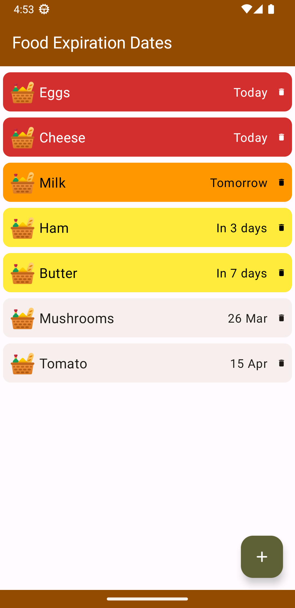
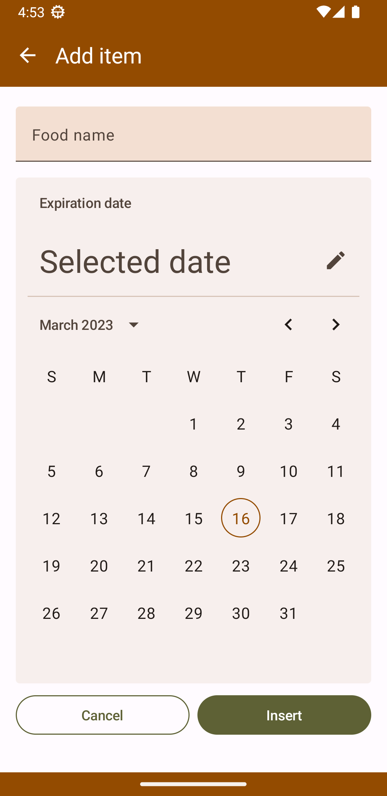
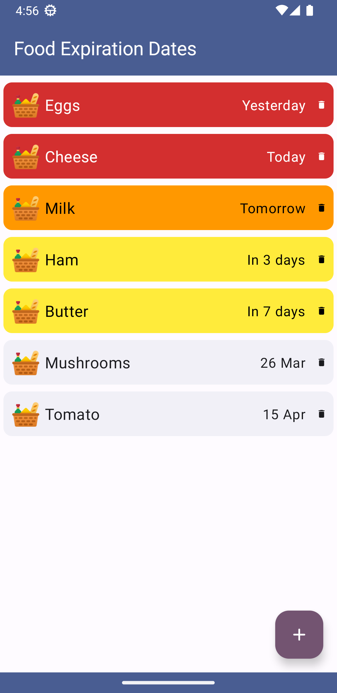
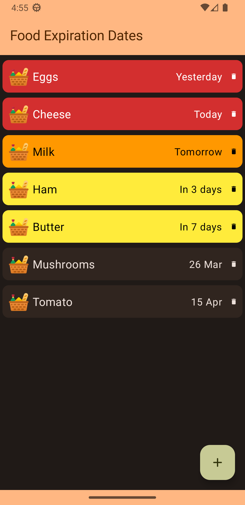
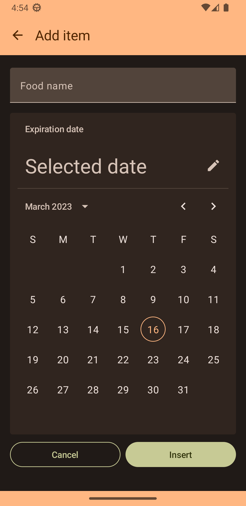
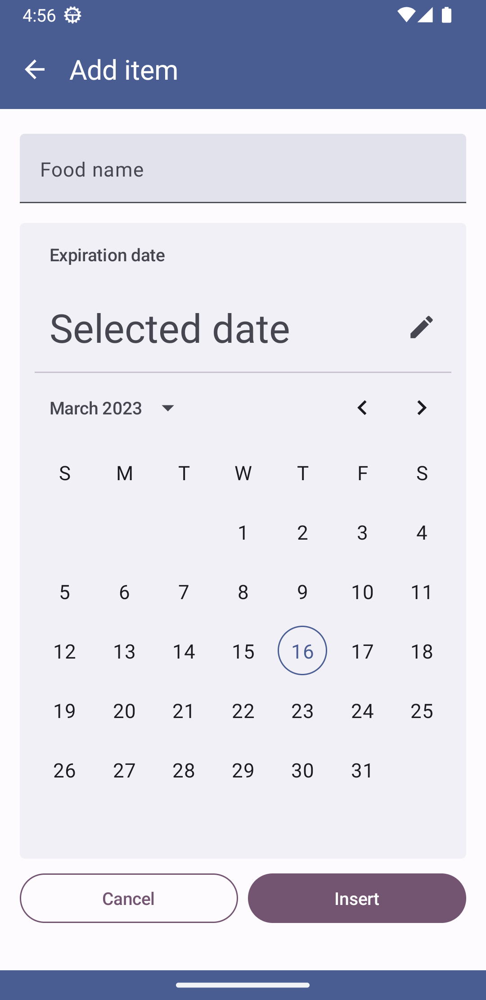

<div align="center">


# Food Expiration Dates


<a href="https://gitmoji.dev">
  
</a>

</div>

Have you ever forgotten to eat a food item before its expiration date? Throwing away food because it has expired is a practice to avoid if you want to reduce food waste.

This simple app helps you avoid forgetting to consume foods that are about to expire. Using it is simple: just record each food item along with its expiration date and you will always have a table reminding you which foods are going to expire!

<div align="center">


[](https://play.google.com/store/apps/details?id=com.lorenzovainigli.foodexpirationdates)
[](https://github.com/lorenzovngl/FoodExpirationDates/releases)


</div>

## ✨ Features

- Display a list of food with their expiration dates in ascending order of time.
- Add, edit and delete items.
- Notifications (available soon).

## 📱 Screenshots

<div align="center">

| | | |
|-|-|-|
|  |  |  | 
 |  |  |

</div>

## 🛠️ Technologies

<div align="center">


</div>

## 🌐 Languages

<div align="center">


</div>

> New translations are welcome. If you want to add a new language to the app, or improve or review an existing one, please [open an issue](https://github.com/lorenzovngl/FoodExpirationDates/issues/new).

## 🏗️ Installation steps

1. Clone the repository

    ```bash
    git clone https://github.com/lorenzovngl/FoodExpirationDates.git
    ```

2. Setup your Firebase project as described below **or** switch to the `foss` build variant to disable the Firebase SDK in the app.

   - Setup your Firebase project:

      1. Create a Firebase project in [Firebase console](https://console.firebase.google.com/);
      2. Get the file `google-services.json` as [explained here](https://support.google.com/firebase/answer/7015592#zippy=%2Cin-this-article:~:text=Get%20config%20file%20for%20your%20Android%20app) and put it in the project root.


3. Run the app!

## 📚 Third Party

- [Material Design Icons](https://pictogrammers.com/library/mdi/)
- [Icons8 Fluency Icons](https://icons8.it/icons/fluency)
- [Marquee by T8RIN](https://github.com/T8RIN/Marquee)

## 👥 Contributors

<a href="https://github.com/lorenzovngl"></a>
<a href="https://github.com/abdulmuizz0903"></a>
<a href="https://github.com/uDEV2019"></a>
<a href="https://github.com/devedroy"></a>
<a href="https://github.com/Quadropo"></a>
<a href="https://github.com/bhavesh100"></a>

## ⚖️ License

```
MIT License

Copyright (c) 2023 Lorenzo Vainigli

Permission is hereby granted, free of charge, to any person obtaining a copy
of this software and associated documentation files (the "Software"), to deal
in the Software without restriction, including without limitation the rights
to use, copy, modify, merge, publish, distribute, sublicense, and/or sell
copies of the Software, and to permit persons to whom the Software is
furnished to do so, subject to the following conditions:

The above copyright notice and this permission notice shall be included in all
copies or substantial portions of the Software.

THE SOFTWARE IS PROVIDED "AS IS", WITHOUT WARRANTY OF ANY KIND, EXPRESS OR
IMPLIED, INCLUDING BUT NOT LIMITED TO THE WARRANTIES OF MERCHANTABILITY,
FITNESS FOR A PARTICULAR PURPOSE AND NONINFRINGEMENT. IN NO EVENT SHALL THE
AUTHORS OR COPYRIGHT HOLDERS BE LIABLE FOR ANY CLAIM, DAMAGES OR OTHER
LIABILITY, WHETHER IN AN ACTION OF CONTRACT, TORT OR OTHERWISE, ARISING FROM,
OUT OF OR IN CONNECTION WITH THE SOFTWARE OR THE USE OR OTHER DEALINGS IN THE
SOFTWARE.
```
